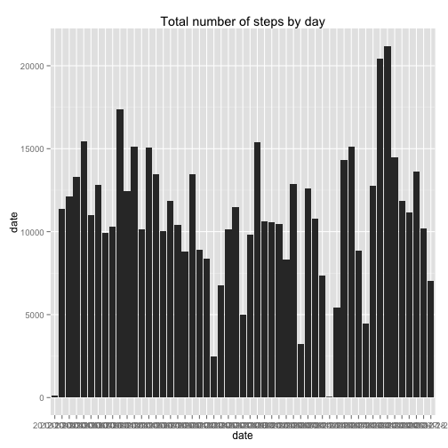
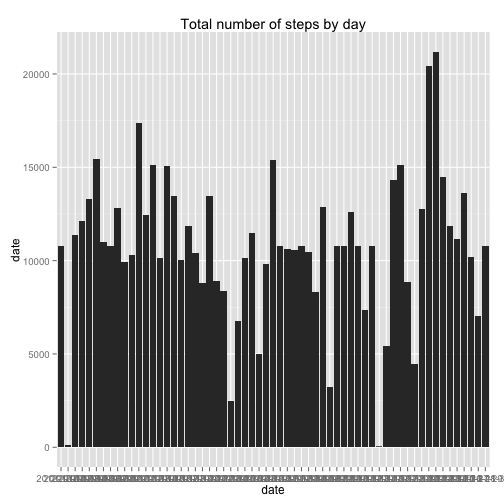

# Reproducible Research: Peer Assessment 1


## Loading and preprocessing the data


```r
activity <- read.csv("activity.csv")
```

## What is mean total number of steps taken per day?

**1. Make a histogram of the total number of steps taken each day**


```r
activityByDates <- aggregate(steps ~ date , data = activity,
                             FUN = sum)
library(ggplot2)
qplot(date, steps, data = activityByDates, stat="identity",
      geom = "histogram", main = "Total number of steps by day",
      ylab = "date")
```

 

**2.Calculate and report the mean and median total number of steps
taken every day**


```r
mean(activityByDates$steps)
```

```
## [1] 10766
```

```r
median(activityByDates$steps)
```

```
## [1] 10765
```

## What is the average daily activity pattern?

**1.Make a time series plot (i.e. `type = "l"`) of the 5-minute
interval (x-axis) and the average number of steps taken, averaged
across all days (y-axis)**


```r
stepsByInterval <- aggregate(steps ~ interval, data = activity,
                             FUN = mean)
plot(stepsByInterval, type = "l")
```

 

**2. Which 5-minute interval, on average across all the days in the dataset, contains the maximum number of steps?**


```r
stepsByInterval$interval[which.max(stepsByInterval$steps)]
```

```
## [1] 835
```

## Imputing missing values

**1.Calculate and report the total number of missing values in the dataset (i.e. the total number of rows with NAs)**


```r
sum(is.na(activity))
```

```
## [1] 2304
```

**2.Devise a strategy for filling in all of the missing values in the dataset. The strategy does not need to be sophisticated. For example, you could use the mean/median for that day, or the mean for that 5-minute interval, etc.**

I will use the mean of the 5-minute interval.

**3. Create a new dataset that is equal to the original dataset but with the missing data filled in.**


```r
mergedActivity <- merge(activity, stepsByInterval, by = "interval",
                        suffixes = c("",".y"))
naVals <- is.na(mergedActivity$steps)
mergedActivity$steps[naVals] <- mergedActivity$steps.y[naVals]
activity <- mergedActivity[,c(1:3)]
```

**4. Make a histogram of the total number of steps taken each day and Calculate and report the mean and median total number of steps taken per day. Do these values differ from the estimates from the first part of the assignment? What is the impact of imputing missing data on the estimates of the total daily number of steps? **

```r
stepsByDates <- aggregate(steps ~ date, data = activity,
                          FUN = sum)
qplot(date, steps, data = stepsByDates, stat="identity",
      geom = "histogram", main = "Total number of steps by day",
      ylab = "date")
```

 

```r
mean(stepsByDates$steps)
```

```
## [1] 10766
```

```r
median(stepsByDates$steps)
```

```
## [1] 10766
```

In most cases, imputing missing data did not affect the estimates. The only difference came with the median being one step more than it was before imputing the missing data.

## Are there differences in activity patterns between weekdays and weekends?

**1. Create a new factor variable in the dataset with two levels – “weekday” and “weekend” indicating whether a given date is a weekday or weekend day.**


```r
typeOfDay <- function(date) {
    if (weekdays(as.Date(date)) %in% c("Saturday", "Sunday")) {
        "weekend"
    }
    else {
        "weekday"
    }
}

activity$typeOfDay <- as.factor(sapply(activity$date, typeOfDay))
str(activity)
```

```
## 'data.frame':	17568 obs. of  4 variables:
##  $ interval : int  0 0 0 0 0 0 0 0 0 0 ...
##  $ steps    : num  1.72 0 0 0 0 ...
##  $ date     : Factor w/ 61 levels "2012-10-01","2012-10-02",..: 1 54 28 37 55 46 20 47 38 56 ...
##  $ typeOfDay: Factor w/ 2 levels "weekday","weekend": 1 1 2 1 2 1 2 1 1 2 ...
```

**2. Make a panel plot containing a time series plot (i.e. type = "l") of the 5-minute interval (x-axis) and the average number of steps taken, averaged across all weekday days or weekend days (y-axis).**


```r
par(mfrow=c(2,1))
for (daytype in c("weekend", "weekday")) {
    averageSteps <- aggregate(steps ~ interval, data=activity,
                              subset=activity$typeOfDay==daytype,
                              FUN = mean)
    plot(averageSteps, type = "l", main = daytype)
}
```

 
